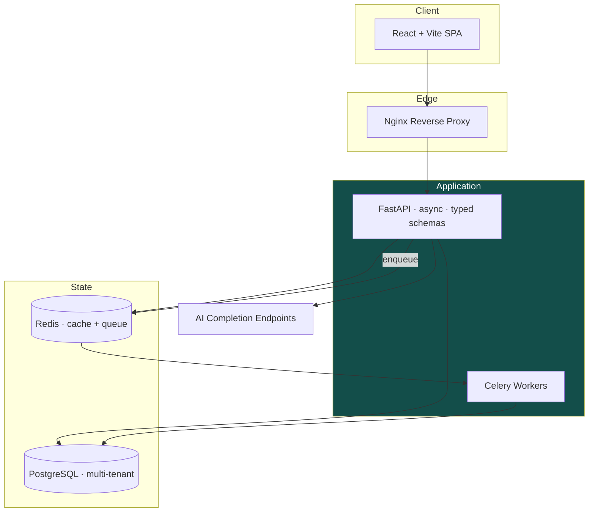
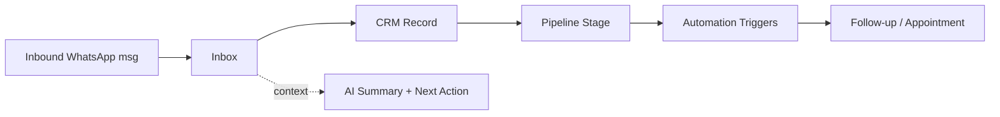

# WADES — WhatsApp-First Operations Platform

> A multi-tenant SaaS that turns scattered WhatsApp conversations into a structured sales & operations command center.
>
> *This is a public architecture showcase. The production SaaS and its business logic are private.*

---

## The Business Problem

Millions of small and mid-sized businesses — clinics, agencies, schools, real-estate brokers, local service firms — sell and support **through messaging long before they ever adopt a CRM**. WhatsApp *is* their pipeline.

But that pipeline is invisible and fragile:

- Conversations are trapped on personal phones and shared inboxes.
- Leads are tracked in spreadsheets, sticky notes, and memory.
- Follow-ups get missed; revenue quietly leaks.
- There's no visibility into who's waiting, what's stalled, or what's working.

## The Solution

**WADES** centralizes messaging-first customer operations into one authenticated, multi-tenant workspace: inbox, CRM records, sales pipeline, appointments, automations, integrations, billing, analytics, and AI-assisted workflows — all in one place.

**Positioning:** a CRM and operations command center for teams that run on messaging. **Not** a chatbot, not a generic CRM — *operational infrastructure for SMB communication workflows*.

---

## Key Features

- **Unified Inbox** — every customer conversation in one place, assignable across a team.
- **Lead Capture & CRM** — structured contact records, sources, tags, and lead scoring.
- **Sales Pipeline** — kanban-style stages that surface where revenue momentum is blocked.
- **Appointments & Scheduling** — book and track meetings inside the workflow.
- **Automations** — trigger-based follow-ups and routing so nothing falls through.
- **AI-Assisted Workflows** — context-aware conversation summaries and suggested next actions, embedded in the operator's view (never a floating chatbot).
- **Multi-Tenant Architecture** — isolated workspaces with per-tenant data separation.
- **Billing & Analytics** — subscription handling and operational visibility.

---

## Architecture

**Multi-tenancy:** every record is scoped to a tenant, with session isolation enforced at the data layer so workspaces never bleed into each other.

---

## Technologies

| Layer | Stack |
|---|---|
| Backend | Python · FastAPI (async) · SQLAlchemy (async) · typed Pydantic schemas |
| Frontend | React · Vite · TypeScript · CSS Modules · Tailwind v4 |
| Database | PostgreSQL |
| Cache / Queue | Redis |
| Background jobs | Celery |
| Infra | Docker · Docker Compose (prod) · Nginx |
| Quality | Pytest · Playwright E2E · CI workflows (backend, frontend, docker, security) |

---

## Screenshots Plan

> *To be captured from the private production app and added to `docs/screenshots/`.*

- [ ] **Dashboard** — "what needs attention right now" (urgency counts, KPIs)
- [ ] **Unified Inbox** — conversation list + active thread
- [ ] **Lead Context Panel** — contact, source, score, activity timeline, AI summary
- [ ] **Sales Pipeline** — kanban with deal cards
- [ ] **Automation builder** — a trigger → action flow
- [ ] **Analytics view** — operational metrics
- [ ] **Mobile/responsive** — inbox on a phone

## Demo Strategy

- **Guided product walkthrough video (2–3 min)** — the primary public artifact, narrating a lead's journey from first message to booked appointment.
- **Annotated screenshots** of each surface (above).
- **Private live sandbox tenant on request** — seeded with demo data, shared read-only with serious prospects (source stays private).

---

## What This Project Demonstrates

Ability to **design and ship a complete, production-grade, multi-tenant SaaS** end-to-end: async FastAPI backend, React frontend, PostgreSQL data modeling, Redis/Celery job processing, Dockerized deployment behind Nginx, full CI, E2E testing, and embedded AI — the full lifecycle of a billable software product.

> 🔒 **Note on scope:** This repository is a showcase. The production codebase, customer data models, billing logic, and internal operational documents are private and intentionally excluded.

---

## Contact

Built by **Oussama Benlaidi** — AI & Full-Stack Engineer.
📫 benlaidiioussama@gmail.com
